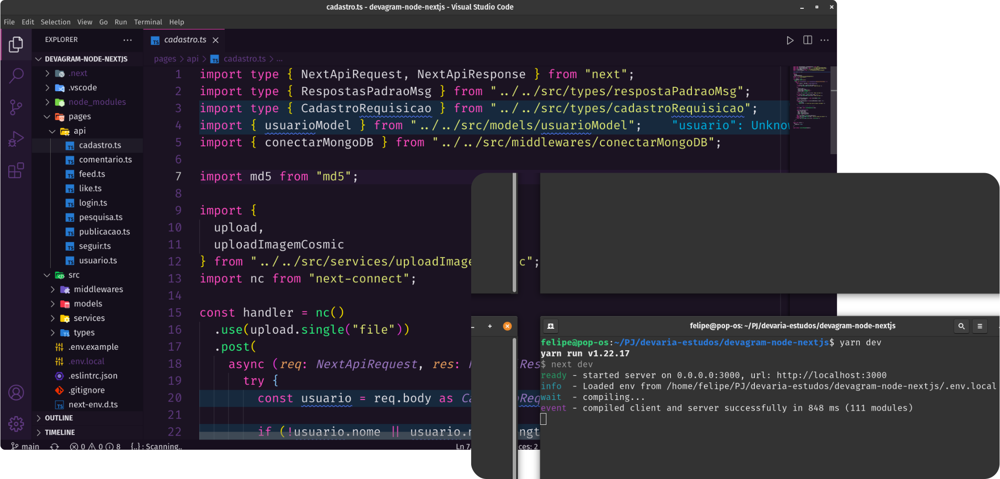

<h1 align="center">Devagram</h1>



## :sparkles: Tecnologias

Esse projeto foi desenvolvido com as seguintes tecnologias:

- <a href="nextjs.org">Next.js</a>
- [Next.Js](nextjs.org)
- [Node.js](nodejs.org)
- [Typescript](https://www.typescriptlang.org/)
- [JSONWebToken](https://jwt.io/)
- [Cosmic](https://www.cosmicjs.com/)
- [Multer](https://www.npmjs.com/package/multer)
- [MongoDB](https://www.mongodb.com/)
- [CORS](https://www.npmjs.com/package/nextjs-cors)

## :computer: Projeto

Devagram é uma plataforma para promover a interação e compartilhamento de publicações.

## :rocket: Como executar

```sh
# Clone o repositório
git clone https://github.com/Feliper-Silva/devagram-node-nextjs.git
```
```sh
# baixar dependências
npm install
```

Crie as chaves no arquivo .env e insira os dados necessários

Verificar conexão no mongodb e no Cosmic
```sh
# iniciar a aplicação.
npm run dev
```

Por fim, a aplicação estará disponível em http://localhost:3000/api

## :page_facing_up: Licença

Esse projeto está sob a licença MIT. Veja o arquivo [LICENSE](LICENSE.md) para mais detalhes.
